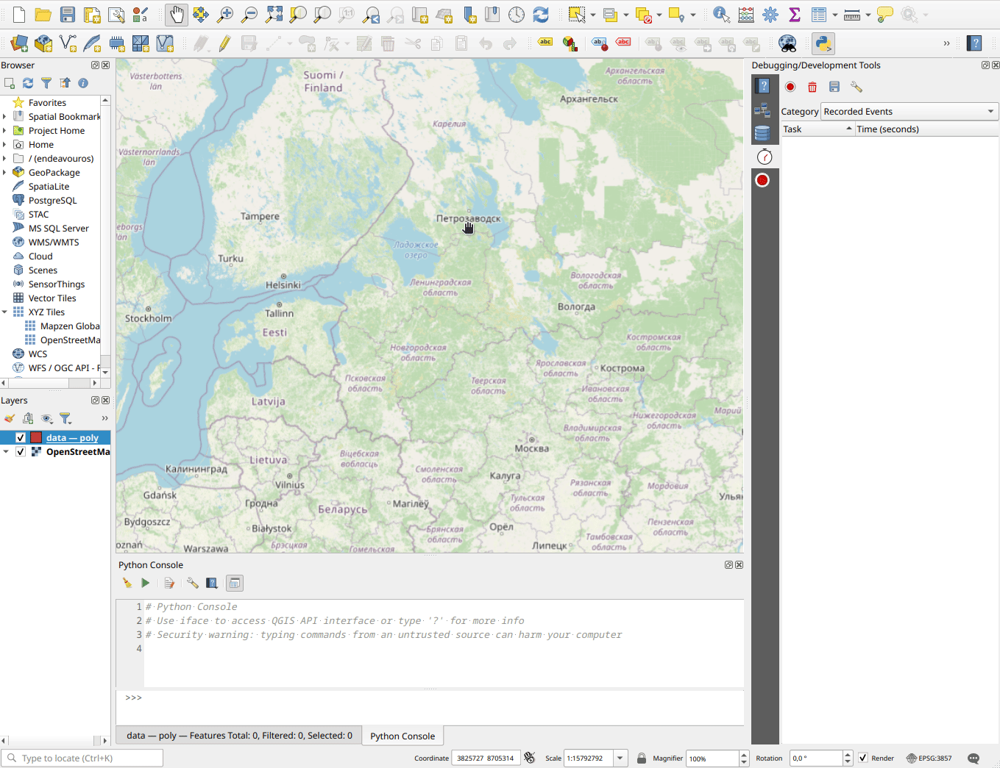

QGIS Profiler Plugin
====================

The QGIS Profiler Plugin extends the built-in QGIS Profiler development tool,
providing a broader Python API for profiling QGIS and QGIS plugins.

Features
--------

* Broader Python API for profiling via the **core library** (``qgis_profiler``)
* Ability to filter and search profile events
* Event recording with various meters (recovery, thread health, map rendering)
* cProfile integration for Python code profiling
* Export profile results to ``.prof`` files for analysis with
  `gprof2dot <https://github.com/jrfonseca/gprof2dot>`_ and
  `snakeviz <https://jiffyclub.github.io/snakeviz/>`_
* Performance meters for detecting anomalies automatically
* Configurable settings

Requirements
------------

* QGIS version **3.40** or higher (including QGIS 4)
* Python **3.12** or higher

.. toctree::
   :maxdepth: 2
   :caption: Contents

   getting-started
   core/index
   plugin/index
   changelog
